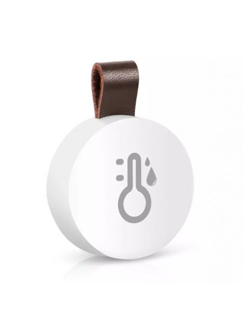

# hygrometer-reporter

## Overview
I wanted a cheap way to use commodity hygrometer hardware and a Raspberry pi to visulaise the data but I got a bit carried away and built a small extensable model for collecting and dumping temperature and humidy data from more or less anything given a little bit of custom sensor code

### Sensors
The sensors should be more or less commodity devices, initially I built this to support the Oria Thermobeacons but there is an `example.py` with a wireframe to build more

### Targets
The original targets are 
- basic CSV file
- Prometheus Push-to-Gateway
- Influx DB

## Dirty install script
 - configure `sensor_config.yml`
 - run `./install.sh "/path/to/this/repo"` as root to dump a systemd service, enable it and start it

## Device Discovery
### Oria Thermobeacon
Massive thanks to https://github.com/rnlgreen/thermobeacon for the majority of the work on this
For these Oria Thermobeacon things which you can find on wish/alibaba/ebay/amazon 
- run `python support/discover_oria_thermobeacon_dot.py` and it should find the right MAC addresses for you
- update the sensor_config.yml

### Hive Heating
**TODO**